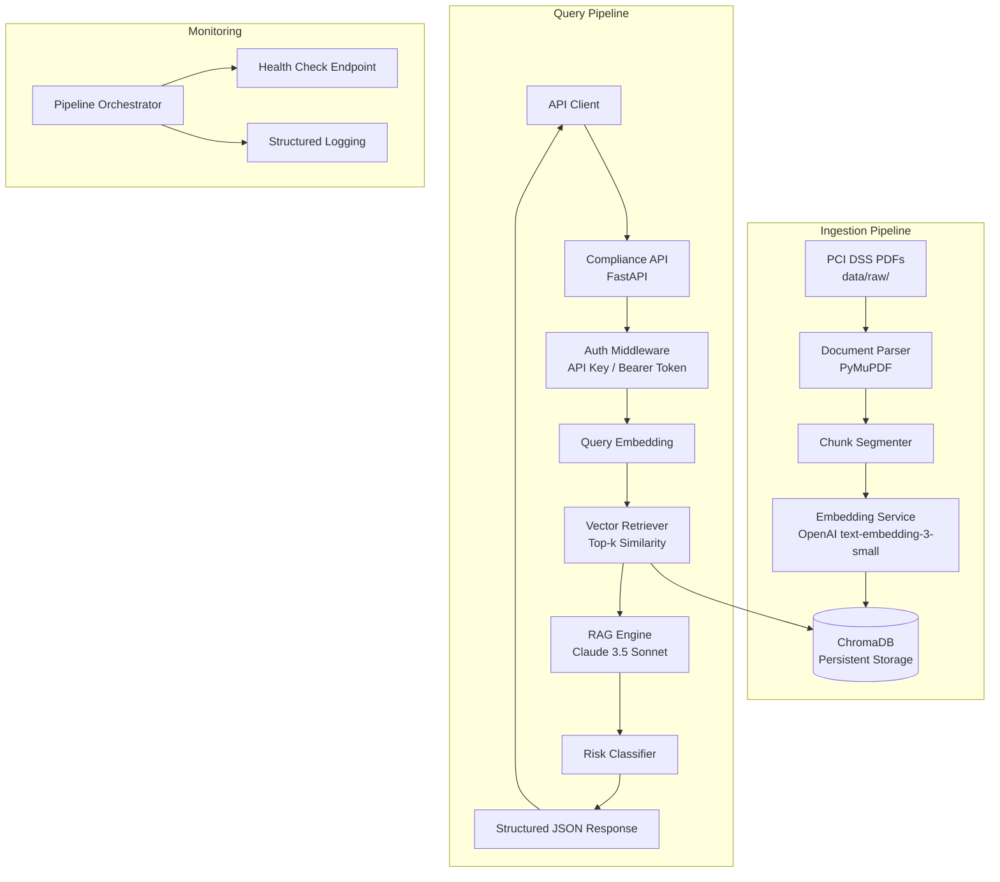

# Design Document: PCI DSS RAG Compliance

## Overview

This design describes a Python-based Retrieval-Augmented Generation (RAG) system that parses PCI DSS v4.0/v4.0.1 PDF documents, generates semantic vector embeddings, stores them in a persistent vector database, and exposes a FastAPI endpoint for compliance queries. The system enforces strict anti-hallucination grounding by returning only source-backed assessments with exact PCI DSS clause citations and programmatic tri-state risk classifications.

### Key Design Decisions

1. **PyMuPDF (fitz) for PDF parsing** — High-performance, handles complex PDF layouts, preserves text structure and page references natively.
2. **ChromaDB as the vector store** — Lightweight, embeddable, supports persistent storage, metadata filtering, and cosine similarity search out of the box. Appropriate for a single-node compliance corpus of bounded size (~5 documents).
3. **OpenAI text-embedding-3-small for embeddings** — 1536 dimensions, cost-effective, strong semantic performance for regulatory text.
4. **Claude 3.5 Sonnet via Anthropic API for generation** — Supports structured JSON output via tool use, enabling deterministic response schemas for risk classification and grounding confidence without external scoring.
5. **FastAPI with Pydantic for the API layer** — Type-safe request/response models, automatic OpenAPI documentation, async support for concurrent query handling.
6. **Hypothesis for property-based testing** — The standard Python PBT library, integrated with pytest, for validating parser round-trip integrity and data model invariants.

### Architecture Rationale

The system follows a pipeline architecture with clear separation between ingestion (parse → chunk → embed → store) and query (retrieve → generate → classify → respond). This separation enables independent scaling and testing of each stage. The anti-hallucination guarantee is enforced at the generation layer by constraining Claude's output to only reference retrieved chunks, with an empty-retrieval fallback that returns "Clause not found" rather than generating unsupported content.

## Architecture



### Component Interaction Flow

1. **Ingestion**: PDFs are parsed page-by-page, segmented into semantically coherent chunks with metadata, embedded via OpenAI API, and stored in ChromaDB with full metadata.
2. **Query**: Incoming compliance queries are validated, embedded using the same model, used to retrieve top-k similar chunks from ChromaDB, then passed to Claude with a constrained prompt that enforces citation-backed responses.
3. **Response**: Claude returns structured JSON (via tool use) containing assessment text, risk classification, citations, and grounding confidence. The API layer validates and returns this to the client.

## Components and Interfaces

### 1. Document Parser (`src/parsers/pdf_parser.py`)

**Responsibility**: Extract text from PCI DSS PDFs preserving section hierarchy, requirement numbering, and page references.

```python
class PDFParser:
    def __init__(self, max_chunk_tokens: int = 512):
        """Initialize parser with configurable chunk size."""
        
    def parse_document(self, file_path: Path) -> ParsedDocument:
        """Parse a PDF file and return structured content."""
        
    def extract_pages(self, file_path: Path) -> list[PageContent]:
        """Extract raw text content page by page with metadata."""
        
    def segment_into_chunks(self, pages: list[PageContent]) -> list[Chunk]:
        """Segment extracted pages into semantically coherent chunks."""
```

**Key behaviors**:
- Uses PyMuPDF `fitz.open()` and `page.get_text("dict")` for structured extraction
- Detects PCI DSS requirement headings via regex patterns (e.g., `Requirement \d+\.\d+`)
- Extends chunk boundaries to complete sentences
- Preserves verbatim text without summarization

### 2. Embedding Service (`src/embeddings/embedding_service.py`)

**Responsibility**: Generate dense vector embeddings for document chunks and queries.

```python
class EmbeddingService:
    def __init__(self, model: str = "text-embedding-3-small", batch_size: int = 100):
        """Initialize with embedding model configuration."""
        
    def embed_chunks(self, chunks: list[Chunk]) -> list[EmbeddingResult]:
        """Batch-embed document chunks with retry logic."""
        
    def embed_query(self, query: str) -> list[float]:
        """Embed a single compliance query for retrieval."""
        
    def _retry_with_backoff(self, func, max_retries: int = 3) -> Any:
        """Retry failed API calls with exponential backoff."""
```

**Key behaviors**:
- Batch processing with configurable batch size for full corpus ingestion
- Exponential backoff retry (3 attempts) on API failures
- Returns embedding vectors alongside chunk metadata for storage

### 3. Vector Store (`src/vectorstore/chroma_store.py`)

**Responsibility**: Persist embeddings and perform semantic similarity retrieval.

```python
class ChromaVectorStore:
    def __init__(self, persist_directory: str = "./data/vectordb", collection_name: str = "pci_dss"):
        """Initialize ChromaDB with persistent storage."""
        
    def add_embeddings(self, embeddings: list[EmbeddingResult]) -> None:
        """Store embeddings with metadata in ChromaDB."""
        
    def query(self, query_embedding: list[float], top_k: int = 5, 
              min_similarity: float = 0.7, requirement_filter: str | None = None) -> list[RetrievedChunk]:
        """Retrieve top-k chunks by cosine similarity with optional filtering."""
        
    def mark_superseded(self, source_file: str) -> None:
        """Mark previous embeddings from a source as superseded."""
```

**Key behaviors**:
- ChromaDB `PersistentClient` with cosine similarity metric
- Metadata filtering by requirement group (e.g., "Requirement 1-3")
- Returns similarity scores with each result
- Empty result set when no chunks exceed minimum similarity threshold

### 4. RAG Engine (`src/rag/engine.py`)

**Responsibility**: Orchestrate retrieval and generation with anti-hallucination constraints.

```python
class RAGEngine:
    def __init__(self, vector_store: ChromaVectorStore, embedding_service: EmbeddingService):
        """Initialize with vector store and embedding service dependencies."""
        
    def process_query(self, query: ComplianceQuery) -> ComplianceResponse:
        """Full RAG pipeline: embed query → retrieve → generate → classify."""
        
    def _build_prompt(self, query: str, context: str | None, chunks: list[RetrievedChunk]) -> str:
        """Construct Claude prompt with anti-hallucination constraints."""
        
    def _generate_response(self, prompt: str, chunks: list[RetrievedChunk]) -> ComplianceResponse:
        """Call Claude 3.5 Sonnet with structured output via tool use."""
```

**Key behaviors**:
- Empty retrieval returns "Clause not found in source documentation" with 🟡 Warning
- Claude prompt explicitly constrains generation to retrieved chunk content only
- Uses Anthropic tool use for structured JSON output (assessment, risk, citations, confidence)
- Low grounding confidence auto-assigns 🟡 Warning and prepends disclaimer
- Detects conflicting chunks and flags conflict with 🟡 Warning

### 5. Compliance API (`src/api/routes.py`)

**Responsibility**: HTTP endpoint for compliance queries with authentication and validation.

```python
@router.post("/api/v1/compliance/query", response_model=ComplianceResponseSchema)
async def query_compliance(
    request: ComplianceQueryRequest,
    api_key: str = Depends(verify_api_key)
) -> ComplianceResponseSchema:
    """Process a compliance query and return cited assessment."""
```

**Key behaviors**:
- API key / bearer token authentication via dependency injection
- Request validation: non-empty query, max 5000 characters
- 30-second timeout on RAG processing
- 503 with Retry-After header when RAG engine is unavailable
- Structured JSON response matching the defined schema

### 6. Pipeline Orchestrator (`src/pipeline/orchestrator.py`)

**Responsibility**: Coordinate document ingestion with observability and resumability.

```python
class PipelineOrchestrator:
    def __init__(self, parser: PDFParser, embedding_service: EmbeddingService, 
                 vector_store: ChromaVectorStore):
        """Initialize with all pipeline components."""
        
    def run_ingestion(self, documents_dir: Path) -> IngestionReport:
        """Run full ingestion pipeline with progress tracking."""
        
    def resume_ingestion(self) -> IngestionReport:
        """Resume from last checkpoint after interruption."""
        
    def get_status(self) -> PipelineStatus:
        """Return current pipeline status for health check."""
```

## Data Models

### Core Domain Models

```python
from pydantic import BaseModel, Field
from enum import Enum
from typing import Literal

class RiskClassification(str, Enum):
    COMPLIANT = "🟢 Compliant"
    WARNING = "🟡 Warning"
    NON_COMPLIANT = "🔴 Non-Compliant"

class GroundingConfidence(str, Enum):
    HIGH = "High"
    MEDIUM = "Medium"
    LOW = "Low"

class Chunk(BaseModel):
    """A semantically coherent segment of a PCI DSS document."""
    id: str = Field(description="Unique chunk identifier")
    text: str = Field(description="Verbatim text content")
    source_file: str = Field(description="Source PDF filename")
    requirement_number: str | None = Field(description="PCI DSS requirement number e.g. '3.3'")
    section_heading: str | None = Field(description="Section heading text")
    page_number: int = Field(description="Source page number")
    chunk_index: int = Field(description="Position within the document for ordering")

class PageContent(BaseModel):
    """Raw extracted content from a single PDF page."""
    page_number: int
    text: str
    headings: list[str]

class ParsedDocument(BaseModel):
    """Result of parsing a full PDF document."""
    source_file: str
    total_pages: int
    chunks: list[Chunk]

class EmbeddingResult(BaseModel):
    """A chunk paired with its vector embedding."""
    chunk: Chunk
    embedding: list[float]

class RetrievedChunk(BaseModel):
    """A chunk retrieved from the vector store with similarity score."""
    chunk: Chunk
    similarity_score: float
```

### API Request/Response Models

```python
class ComplianceQueryRequest(BaseModel):
    """Incoming compliance query from the API."""
    query: str = Field(min_length=1, max_length=5000, description="Compliance question text")
    context: str | None = Field(default=None, description="Optional system architecture or payment flow context")

class ComplianceResponseSchema(BaseModel):
    """Structured compliance assessment response."""
    assessment: str = Field(description="Citation-backed compliance assessment text")
    risk_classification: RiskClassification = Field(description="Tri-state risk classification")
    citations: list[str] = Field(description="Exact PCI DSS clause references")
    grounding_confidence: GroundingConfidence = Field(description="Source backing confidence level")
    retrieved_chunk_ids: list[str] = Field(description="IDs of retrieved chunks for auditability")
```

### Pipeline State Models

```python
class PipelineStatus(str, Enum):
    IDLE = "idle"
    RUNNING = "running"
    ERROR = "error"

class IngestionCheckpoint(BaseModel):
    """Tracks ingestion progress for resumability."""
    last_processed_file: str | None
    processed_files: list[str]
    failed_files: list[str]
    timestamp: str

class IngestionReport(BaseModel):
    """Summary of an ingestion pipeline run."""
    total_documents: int
    successful: int
    failed: int
    total_chunks: int
    total_embeddings: int
    duration_seconds: float
    failures: list[dict]
```

## Correctness Properties

*A property is a characteristic or behavior that should hold true across all valid executions of a system — essentially, a formal statement about what the system should do. Properties serve as the bridge between human-readable specifications and machine-verifiable correctness guarantees.*

### Property 1: Document Chunking Round-Trip

*For any* valid document text consisting of one or more sections, parsing the text into chunks and then concatenating all chunks in order SHALL produce text equivalent to the original document content.

**Validates: Requirements 8.1, 8.2, 8.3**

### Property 2: Chunk Size and Sentence Boundary Invariants

*For any* multi-sentence text and any configurable max_chunk_tokens value, every chunk produced by the parser SHALL have a token count less than or equal to max_chunk_tokens AND shall end at a sentence boundary (except for the final chunk in a section).

**Validates: Requirements 1.2, 8.4**

### Property 3: Chunk Metadata Completeness

*For any* chunk produced by the Document_Parser from a valid PDF document, the chunk SHALL have non-null values for source_file, page_number, and chunk_index fields.

**Validates: Requirements 1.3**

### Property 4: Embedding Store-Retrieve Round-Trip

*For any* chunk with associated embedding stored in the Vector_Store, retrieving that chunk by its ID SHALL return the exact same text content, all metadata fields (requirement_number, section_heading, source_file, page_number), and a valid similarity score.

**Validates: Requirements 2.2, 3.3**

### Property 5: Retrieval Ordering by Similarity

*For any* query embedding and result set returned by the Vector_Store, the results SHALL be ordered in strictly non-increasing order of cosine similarity score.

**Validates: Requirements 3.1**

### Property 6: Top-K Result Set Size Constraint

*For any* top_k value in the range [1, 20] and any collection of N stored chunks, the number of results returned SHALL be less than or equal to min(top_k, N_matching) where N_matching is the number of chunks exceeding the similarity threshold.

**Validates: Requirements 3.2**

### Property 7: Requirement Group Filter Correctness

*For any* requirement group filter applied to a retrieval query, all returned chunks SHALL have a requirement_number that falls within the specified group range.

**Validates: Requirements 3.5**

### Property 8: Response Schema Conformance

*For any* valid compliance query that produces a non-empty retrieval, the response SHALL contain: an assessment (non-empty string), a risk_classification that is exactly one of "🟢 Compliant", "🟡 Warning", or "🔴 Non-Compliant", a citations array of strings, a grounding_confidence that is exactly one of "High", "Medium", or "Low", and a retrieved_chunk_ids array of strings.

**Validates: Requirements 4.2, 5.5, 6.1**

### Property 9: Input Validation Boundary

*For any* query string that is empty (or whitespace-only) OR exceeds 5000 characters, the Compliance_API SHALL return a 400 status code with a descriptive error message.

**Validates: Requirements 4.4**

### Property 10: Citation Presence in Assessments

*For any* compliance response generated from a non-empty retrieval result, the citations array SHALL contain at least one element referencing a specific PCI DSS requirement number.

**Validates: Requirements 5.2**

### Property 11: Citation Format Consistency

*For any* citation string in a compliance response, the citation SHALL match the pattern "Requirement X.Y[.Z] under PCI DSS v4.0.1, Section [section_name]" where X, Y, Z are numeric identifiers and section_name is a non-empty string.

**Validates: Requirements 5.3**

### Property 12: Low Confidence Safety Override

*For any* compliance response where grounding_confidence is "Low", the risk_classification SHALL never be "🟢 Compliant" AND the assessment text SHALL begin with a disclaimer indicating low source confidence.

**Validates: Requirements 5.6, 6.5**

### Property 13: Retrieved Chunk ID Auditability

*For any* successful compliance response, the retrieved_chunk_ids array SHALL be non-empty and every ID in the array SHALL correspond to a chunk that exists in the Vector_Store.

**Validates: Requirements 7.4**

## Error Handling

### Document Parser Errors

| Error Condition | Behavior | Response |
|---|---|---|
| Corrupted PDF file | Log error with file path, skip file | Continue pipeline, include in failure summary |
| Unsupported file format | Log error, skip file | Continue pipeline, include in failure summary |
| Empty PDF (no extractable text) | Log warning, produce zero chunks | Continue pipeline, document noted in report |

### Embedding Service Errors

| Error Condition | Behavior | Response |
|---|---|---|
| OpenAI API rate limit (429) | Exponential backoff, 3 retries | Log failure for affected chunks after exhaustion |
| OpenAI API timeout | Retry with backoff | Log failure after 3 attempts |
| Invalid embedding dimension | Reject and log | Skip chunk, continue batch |

### Vector Store Errors

| Error Condition | Behavior | Response |
|---|---|---|
| ChromaDB connection failure | Raise service unavailable | Pipeline stops, can resume |
| Disk space exhausted | Raise storage error | Pipeline stops, alert via logs |
| Corrupted index | Log error | Return empty results, trigger re-index |

### API Layer Errors

| Error Condition | HTTP Status | Response Body |
|---|---|---|
| Empty or oversized query | 400 | `{"error": "Query must be 1-5000 characters"}` |
| Missing/invalid auth token | 401 | `{"error": "Authentication required"}` |
| RAG engine unavailable | 503 | `{"error": "Service temporarily unavailable", "retry_after": 30}` |
| Processing timeout (>30s) | 504 | `{"error": "Query processing timed out"}` |
| Internal error | 500 | `{"error": "Internal server error"}` |

### RAG Engine Errors

| Error Condition | Behavior | Response |
|---|---|---|
| Empty retrieval (no matching chunks) | Return fallback message | `"Clause not found in source documentation"` with 🟡 Warning |
| Claude API failure | Retry once, then fail | 503 to API caller |
| Conflicting source chunks | Flag in assessment | Include all sources, assign 🟡 Warning |
| Low grounding confidence | Prepend disclaimer, override classification | Never assign 🟢, always 🟡 minimum |

## Testing Strategy

### Property-Based Testing (Hypothesis)

The project uses [Hypothesis](https://hypothesis.readthedocs.io/) as the property-based testing library. Each property test runs a minimum of 100 iterations with randomized inputs.

**Configuration:**
```python
from hypothesis import given, settings, HealthCheck
from hypothesis import strategies as st

@settings(max_examples=100, suppress_health_check=[HealthCheck.too_slow])
```

**Property test tagging format:**
```python
# Feature: pci-dss-rag-compliance, Property 1: Document Chunking Round-Trip
```

**Properties to implement:**
- Properties 1–2: Parser round-trip and chunking invariants (pure function, generate random multi-section text)
- Property 3: Metadata completeness (generate random parsed documents)
- Properties 4–7: Vector store properties (use in-memory ChromaDB for tests, generate random embeddings)
- Properties 8–13: Response-level properties (mock Claude responses, generate random valid/invalid queries)

### Unit Tests (pytest)

Focus on specific examples, edge cases, and error conditions:
- PDF parsing with real fixture files (small PCI DSS excerpts)
- Retry/backoff behavior with mocked API failures
- Authentication rejection scenarios
- Empty retrieval fallback behavior
- Pipeline interruption and resumption
- Health check endpoint response format

### Integration Tests

End-to-end verification with mocked external services:
- Full ingestion pipeline with a small test PDF
- Query flow from API request through retrieval and generation
- Document re-ingestion and supersession logic
- Concurrent query handling

### Test Organization

```
tests/
├── unit/
│   ├── test_pdf_parser.py
│   ├── test_embedding_service.py
│   ├── test_vector_store.py
│   ├── test_rag_engine.py
│   └── test_api_validation.py
├── property/
│   ├── test_chunking_properties.py
│   ├── test_vectorstore_properties.py
│   └── test_response_properties.py
└── integration/
    ├── test_ingestion_pipeline.py
    └── test_query_flow.py
```

### Dependencies

```
pytest>=7.4
hypothesis>=6.100
pytest-asyncio>=0.23
httpx>=0.25 (for async API testing)
```

